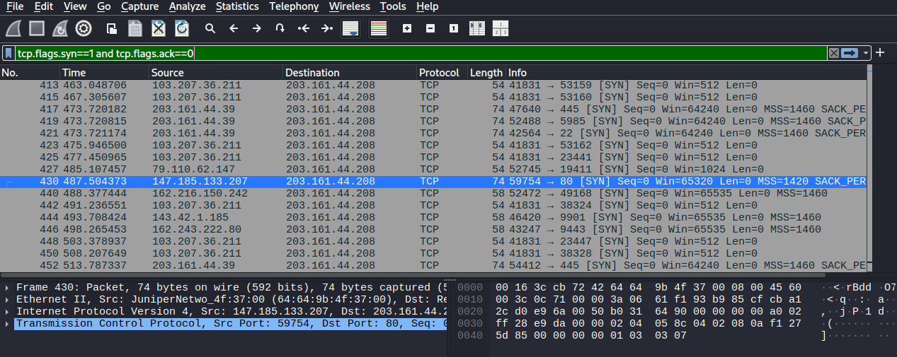
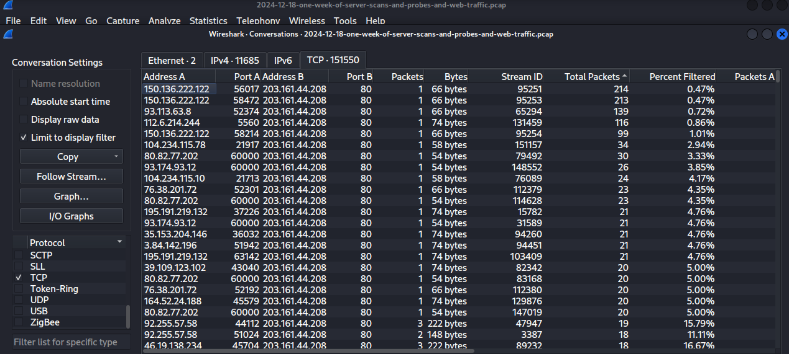

# PCAP Analysis: Distinguishing Background Scan Noise from Targeted Attacks

**File analyzed:** `2024-12-18-one-week-of-server-scans-and-probes-and-web-traffic.pcap`
**Tool used:** Wireshark
**Date:** 2024-12-18

## Summary

Analyzed a public pcap capturing one week of traffic hitting a server exposed to the internet, with the goal of determining whether the connection attempts represented targeted attacks or routine internet background noise.

## Objective

Given raw traffic with no prior context, answer:
1. What's the target/victim IP?
2. What external IPs/domains does it contact?
3. Are there any file downloads?
4. Is this a targeted attack or opportunistic noise?

## Method

### Step 1 — High-level overview
`Statistics → Protocol Hierarchy` to see overall protocol distribution before diving into individual packets.

### Step 2 — Identify conversation patterns
`Statistics → Conversations → TCP tab`, sorted by packet count, to see which IP pairs were exchanging the most data or the most attempts.

### Step 3 — Isolate connection attempts
Applied the filter:
```
tcp.flags.syn==1 and tcp.flags.ack==0
```
This isolates SYN-only packets — the first step of every TCP handshake — regardless of whether the connection succeeded. This is the standard filter for spotting scanning/probing activity.

### Step 4 — Confirm target IP behavior
Filtered:
```
ip.addr==203.161.44.208
```
and reviewed the full conversation for each source IP contacting it.

## Findings

- The destination `203.161.44.208` received connection attempts from **dozens of distinct external source IPs** (e.g. `103.207.36.211`, `79.110.62.147`, `147.185.133.207`, `162.216.150.242`, `143.42.1.185`, `1.9.44.249`, `1.20.91.9`, and many more).
- Each source IP made **only 1–3 packets total**, then never appeared again in the capture.
- Target ports varied widely and matched classic scan targets: **23 (Telnet)**, **445 (SMB)**, **3128 (Squid proxy)**, **9000**, **9443**, **34568**.
- Most attempts ended in a **RST/RST-ACK** — the port was closed or the connection was immediately rejected — rather than a completed handshake.
- One connection (source `147.185.133.207`, port 80) *did* complete a full handshake (SYN → SYN-ACK → ACK) followed by a legitimate `GET / HTTP/1.1` request and `200 OK` response — ordinary web traffic, unrelated to the scanning activity.

## Verdict: Background scan noise, not a targeted attack

**Reasoning:** the distinguishing signal between "attack" and "noise" isn't whether contact happened — it's repetition and intent from a single source.

| Pattern observed | What it would indicate |
|---|---|
| 1 source, 1–3 packets, never seen again (**what we found**) | Random internet-wide scanner — noise |
| 1 source, hundreds of SYNs to many ports on one target | Port scan (reconnaissance) |
| 1 source, repeated attempts on the same port | Brute-force attempt |
| Many SYNs, no completed handshakes, spoofed-looking sources | SYN flood / DoS |
| Full handshake + real application data | Legitimate traffic |

No single source IP showed sustained or repeated activity against the target. 
This matches the well-known phenomenon of **internet background radiation** — the constant, automated scanning
every internet-facing IP address receives 24/7 from bots, research scanners (e.g. Shodan/Censys-style crawlers), and opportunistic botnets probing for exploitable services like open Telnet or vulnerable SMB.

## Takeaway

The core SOC skill demonstrated here: correctly distinguishing "the entire internet poking at everything
" from "one attacker hammering one target" — a judgment call made routinely when triaging alerts in a real SOC environment.


## Screenshots

**SYN-only filter isolating connection attempts:**


**Conversations view showing dozens of one-off source IPs:**


